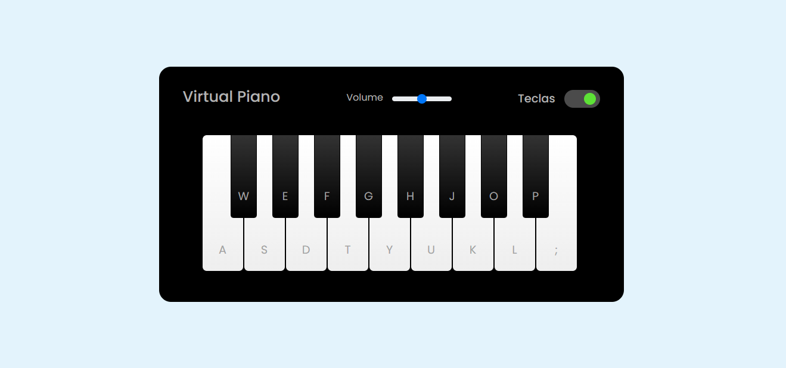
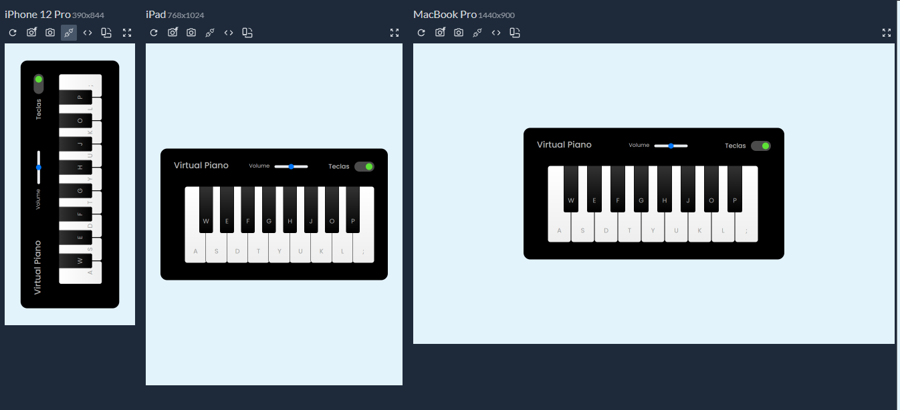

# Virtual Piano

## Um piano virtual feito com JavaScript

Desenvolvi esse pequeno piano pelas aulas do bootcamp Potência Tech Ifood - Desenvolvimento de Jogos ds DIO , Usando HTML , CSS e JavaScript  

### Construído com

